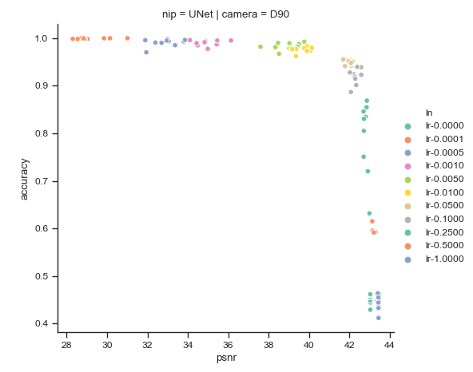
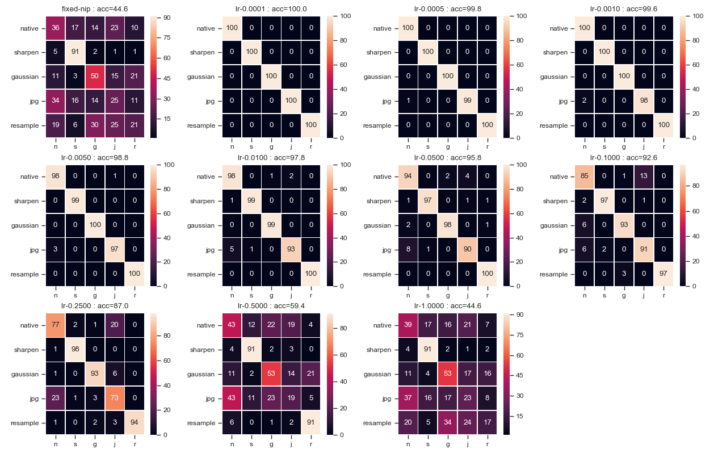

# Plotting Results

The results can be quickly inspected / exported with the `results.py` script. Supported output modes are shown in table below. Data can be exported by appending `--df {output dir}` .

| Output mode                     | Description                                                  |
| ------------------------------- | ------------------------------------------------------------ |
| `scatter-psnr` / `scatter-ssim` | show accuracy / image quality trade-off (NIP optimization)   |
| `progress`                      | show training progress                                       |
| `conf` / `conf-tex`             | print confusion matrices as plain text or LaTeX tables       |
| `ssim` / `psnr`/`accuracy`      | boxplots with image quality / accuracy                       |
| `df`                            | print results' summary as a table                            |
| `auto`                          | automatically parse the results' structure and plot accuracy for various configurations |

For example, the following command shows the scatter plot with the trade-off between classification accuracy and image fidelity for the `UNet` model trained on `Nikon D90` :

```bash
> python3 results.py --nip UNet --cam D90 scatter-psnr
```



To visualize variations of classification accuracy and image quality as the training progresses:

```bash
> python3 results.py --nip UNet --cam D90 progress
```


To show confusion matrices for all regularization strengths:

```bash
> python3 results.py --nip UNet --cam D90 confusion
```


**Show Differences in NIP models**

This command shows differences between a UNet model trained normally (A) and with manipulation detection objectives (B). 

```bash
> python3 diff_nip.py --nip UNet --cam D90 --b ./data/m/D90/UNet/ln-0.1000/000/models/ --image 16
```

